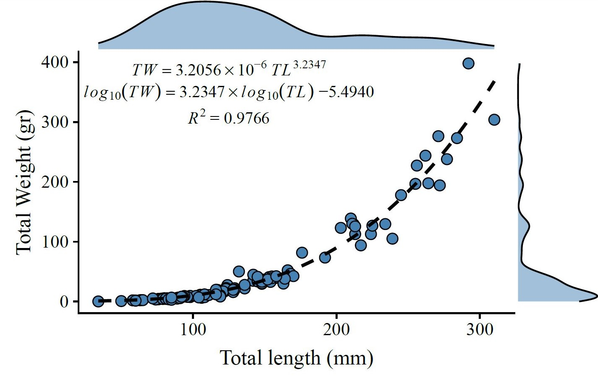
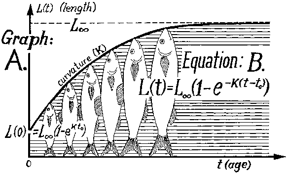

```{r setup, include=FALSE}
knitr::opts_chunk$set(echo = TRUE,
                      warning = F,
                      message = F,
                      error = T)
```

# Exercise 1: length-weight relationship

## Goal

Build a user-defined function

$$W = aL^b$$

- $a$ is very small (in the order of $\times 10 ^{-3}$)
- $b$ ~ 3



## Task

- Write a function called `LengthWeight()`
- Takes three input parameters: `L`, `a`, and `b`
- returns `W` using this equation.

```{r}
# This function will not work
LengthWeight <- function(L, a, b){
  W = a * (L ^ b)
}
```

Test the function

```{r}
LengthWeight(L = 30, a = 0.0002, b = 3.05)
```

Doesn't return anyhing. Not even an error or warning message... What happened?

## Things to keep in mind

### `return` statement

```{r}
LengthWeight <- function(L, a, b){
  W = a * (L ^ b)
  return(W)
}

LengthWeight(L = 30, a = 0.0002, b = 3.05)
```

```{r}
LengthWeight <- function(L, a, b){
  a * (L ^ b)
}

LengthWeight(L = 30, a = 0.0002, b = 3.05)
```

### Define default values of parameters

```{r}
LengthWeight <- function(L = 30, a = 0.0002, b = 3.05){
  W = a * (L ^ b)
  return(W)
}

LengthWeight()
```

### Override fedault values of parameters

```{r}
LengthWeight(L = 45, a = 0.001, b = 3.1)
```

### Apply function to a vector of lengths

Imagine I sampled 10,000 fish from port, and was only able to take their lengths. Or that I did underwater surveys and recorded fish length. On any case, I don't want to use the function 10,000 times. How do I use my LengthWeight function 10,000 times?

First let me just randomly simulate 1,000 fish lengths between 15 cm and 75 cm.

```{r}
set.seed(43) # Set a random seed to obtain consistent random numbers
lengths <- runif(n = 10000, min = 15, max = 75) # Get 1000 lengths
hist(lengths)
```


#### `for` loop?

```{r}
# WRONG!

ptm <- proc.time()
weights <- numeric(length = 10000)
for (i in 1:10000){
  weights[i] <- LengthWeight(L = lengths[i])
}

# for loops are VERY slow

proc.time() - ptm
```

#### `R` is vectorized

Avoid `for` loops as much as you can! ALthough there are some cases where you HAVE to use them.

```{r}
ptm <- proc.time()
weights <- LengthWeight(L = lengths)
proc.time() - ptm
```


# Exercise 2: von Bertalanffy growth equation

## Goal

Build a more complex user-defined function

$$L = L_{\infty} \left(1 - e^{-k(t - t_0)}\right)$$



## Task

- Write a function `VonBert`
-T akes four parameters: `age` (yr), `k`, `Linfinity` (cm), and `t0` (yr)
- Returns `length` (cm) from the von Bertalanffy equation

```{r}
VonBert <- function(age, k = 0.2, Linfinity = 80, t0 = -0.2){
  length <- Linfinity * (1 - exp(-k * (age - t0)))
  return(length)
}
```

Test the function

```{r}
VonBert(age = 5)
```

## Things to keep in mind

You can use functions sequentially.

How much does teh fish above weight?

### Approach 1

Save length-at-age into variable, then use that as input for length-weight function

```{r}
length <- VonBert(age = 5)
LengthWeight(L = length)
# I could have saved the above into a variable, but nah
```

### Approach 2

*Nested* functions

```{r}
LengthWeight(L = VonBert(age = 5))
```

### Approach 3

`tidyverse` approach using the pipe `%>%` (Ctrl / Cmd + Shift + M) from the `magrittr` package

```{r}
library(magrittr)

VonBert(age = 5) %>% 
  LengthWeight()
```

Or even cooler

```{r}
age <- 5

age %>% 
  VonBert() %>% 
  LengthWeight()
```

Vectorized and plotting directly

```{r}
ages <- 1:60

ages %>% 
  VonBert() %>% 
  LengthWeight() %>% 
  plot(x = ages, type = "p", col = "steelblue", pch = 16)

```

# Exercise 3: looping over age, printing age squared

## Goal

Practice writing `for` loops

## Task

- Write a function `AgeSquare()`
- Takes a vector `ages` as an input
- Print out the square of the ages

Inside the function, you will:

- Use the `length()` function to calculate how many elements there are in the ages vector
- Store this in a variable `nages`
- Then loop through the values in the `ages` vector using a `for` loop
- Use `print()` to output the square of each length

```{r}
AgeSquare <- function(ages){
  nages <- length(ages)
  for (i in 1:nages){
    print(ages[i]^2)
  }
}
```

Test it

```{r}
AgeSquare(ages=1:10)
```

## Things to keep in mind

This is actually what we would call a `command`. `functions` should return a value, while `commands` execute an operation. `write.csv`, `print`, `cat`... are commands.

Can I assign function output to a variable?

```{r}
age2 <- AgeSquare(ages=1:10)
age2
```

This function is not very useful, but it is meant to make you think about how to set up `for` loops for the few times where you will need to use them.

# Exercise 4: looping over age, printing length

## Goal

Call a user-defined function within a user-defined function (simila but not quite the same as nesting functions)

## Task

- Copy your `AgeSquare()` function, and rename it `AgeLengths()`
- It will now take as parameters a vector `ages`, and parameters `k`, `Linfinity`, and `t0` for the von Bertalanffy growth equation

Inside the `for` loop:

- Instead of calculating and printing the square of the ages, call the `VonBert()` function you created in Exercise 2 to calculate and print the length at each age in the vector

```{r}
AgeLengths <- function(ages, k = 0.2, Linfinity = 80, t0 = -0.2){
  nages <- length(ages)
  for (i in 1:nages){
    print(VonBert(ages[i], k = k, Linfinity = Linfinity, t0 = t0))
  }
}
```

```{r}
AgeLengths(ages=1:10)
```

## Things to keep in mind

You can do this same operation in other ways, depending on what you want. The above will work just fine, but it i) uses a `for` loop that we don't need, and ii) doesn't let you save the lengths to a variable. Let's address both problems.

### Avoid `for` loop by vectorizing

```{r}
AgeLengths <- function(ages, k = 0.2, Linfinity = 80, t0 = -0.2){
    print(VonBert(ages, k = k, Linfinity = Linfinity, t0 - t0))
}
```

Test it

```{r}
AgeLengths(ages=1:10)
```

Note that this function prints a long thing, rather than a tall thing. Also, notice the braketed number on the side. This printed a vector, instead of just a nummber.

Can I save to variable?

```{r}
lengths <- AgeLengths(ages=1:10)
lengths
```

Yes! But it's still printing, and I don't like that.

### Save output without printing

```{r}
AgeLengths <- function(ages, k = 0.2, Linfinity = 80, t0 = -0.2){
    return(VonBert(ages, k = k, Linfinity = Linfinity, t0 - t0))
}
```

```{r}
AgeLengths(ages=1:10)
```

# Exercise 5: looping over age, storing and returning a vector of lengths

## Goal

Practice creating vectors, storing values in them, and returning the vector

## Task

- Copy your `AgeLengths()` function, and rename it `AgeLengthsVec()`
- Instead of using `print()` to report the calculated lengths, it will now return a vector `lengths`

Inside the function you will need to:

- Create an empty vector `lengths` using the `numeric()` function
- In the `for` loop store the calculated length in element `i` of the `lengths` vector, `lengths[i]`
- At the end of the function, return the calculated vector using the `return()` command

```{r}
AgeLengthsVec <- function(ages, k = 0.2, Linfinity = 80, t0 = -0.2){
  nages <- length(ages)
  lengths <- numeric(length = nages)
  for (i in 1:nages){
    lengths[i] <- VonBert(ages[i], k = k, Linfinity = Linfinity, t0 = t0)
  }
  return(lengths)
}
```

```{r}
lengths <- AgeLengthsVec(ages=1:10)
lengths
```

## Things to keep in mind

Again, this function can be made faster by vectorizing

```{r}
AgeLengthsVec <- function(ages, k = 0.2, Linfinity = 80, t0 = -0.2){
  lengths<- VonBert(ages, k = k, Linfinity = Linfinity, t0 = t0)
  return(lengths)
}
```

If you think about it, this function is not doing anything special other than taking the exact same inputs and passing them to another function in the exact same way... but you get the jist.

> No more loops from now on


# Exercise 6:  looping over age, length and weight

## Goal

Learn how to compartmentalize your code

## Task

Having built functions that convert age to length, and length to weight, now we can loop through vectors of
age and predict the length and weight for fish at that age

- Create a function `AgeValues()`
- That takes as input a vector of ages `age.vec`, and the parameters in the above functions
- And uses the functions you created in exercises 1 and 2 to return length at each age, and weight at each age.

```{r}
AgeValues <- function(age.vec, k = 0.2, Linfinity = 80, t0 = -0.2, a = 0.0002, b = 3.05){
  lengths <- VonBert(age = age.vec, k = k, Linfinity = Linfinity, t0 = t0)
  weights <- LengthWeight(L = lengths, a = a, b = b)
  
  return(list(lengths, weights))
}
```

```{r}
AgeValues(0:10)
```

## Things to keep in mind

You can have different classes of return statement, depending on what you want.

Unless you jump into the `apply` and `purrr` world, `lists` are difficult to work with. For example, we can't just plot from the list:

```{r}
AgeValues(0:10) %>% 
  plot()
```


The above returns a list, because we told it to. You might want other things

### Return a `matrix`

```{r}
AgeValues <- function(age.vec, k = 0.2, Linfinity = 80, t0 = -0.2, a = 0.0002, b = 3.05){
  lengths <- VonBert(age = age.vec, k = k, Linfinity = Linfinity, t0 = t0)
  weights <- LengthWeight(L = lengths, a = a, b = b)
  
  return(matrix(c(lengths, weights), ncol = 2))
}
```

```{r}
AgeValues(0:10)
AgeValues(0:10) %>% 
  plot(type = "p", col = "steelblue", pch = 16)
```

### Return a `data.frame`

```{r}
AgeValues <- function(age.vec, k = 0.2, Linfinity = 80, t0 = -0.2, a = 0.0002, b = 3.05){
  lengths <- VonBert(age = age.vec, k = k, Linfinity = Linfinity, t0 = t0)
  weights <- LengthWeight(L = lengths, a = a, b = b)
  
  return(data.frame(lengths, weights))
}
```

```{r}
AgeValues(0:10)
AgeValues(0:10) %>% 
  plot(col = "steelblue", pch = 16)
```

# Exercise 7: calculating Beverton-Holt steepness curves

The Beverton-Holt stock-recruitment curve can be parameterized with a steepness parameter $h$, together with $R_0$ (unfished recruitment) and $S_0$ (unfished spawning biomass) using the following set of equations:

$$
S_0 = SPR_0 \times R_0
$$

$$
\alpha = \frac{1 - h}{4hR_0}S_0
$$

$$
\beta = \frac{5h - 1}{4hR_0}
$$

$$
R_{t+1} = \frac{S_t}{\alpha + \beta S_t}
$$
## Goal

Run the same function many times to compare parameter values

## Task

- Assume that the spawner-per-recruit in the absence of fishing ($SPR_0$) has been calculated already
- The parameters of the Beverton-Holt equation will be $h$, $R_0$ and $S_0$
- Create a function `BevHolt()`
- Takes as an input these three parameters, and loops over (remember, not looping any more)
- 100 equally-spaced values of spawning biomass $S_t$ from 0 to $S_0$, using the `length.out` option of `seq()`
- For each value of spawning biomass, calculates and stores the corresponding recruitment $R_{t+1}$
- Store the values of $S_t$ and $R_{t+1}$ in vectors `Svec` and `Rvec`
- Create a plot to illustrate the relationship between the two
- Vary h to examine how the curve looks at different steepness values

> Note: if you set $S_0 = 1$ and $R_0 = 1$ then the plot will be relative to unfished levels


```{r}
BevHolt <- function(h = 0.5, R0 = 1, S0 = 1){
  alpha <- ((1 - h) / (4 * h * R0)) * S0
  beta <- ((5 * h) - 1) / (4 * h * R0)
  
  Svec <- seq(from = 0, to = S0, length.out = 100)
  Rvec <- Svec / (alpha + (beta * Svec))

  plot(x = Svec, y = Rvec, type = "l", col = "steelblue")
}
```

```{r}
BevHolt()
```


## Things to keep in mind

Functions should only do one thing (*i.e.* Generate data, transform data, calculate a variable, plot something...)

Why? well, I can't get the sample plot by just using the function above. i might want to generate lots of data for different values of $h$ and then look at it together.

### BevHolt returns values as data.frame

```{r}
BevHolt <- function(h = 0.5, R0 = 1, S0 = 1){
  alpha <- ((1 - h) / (4 * h * R0)) * S0
  beta <- ((5 * h) - 1) / (4 * h * R0)
  
  Svec <- seq(from = 0, to = S0, length.out = 100)
  Rvec <- Svec / (alpha + (beta * Svec))

  results <- data.frame(h = h, Svec = Svec, Rvec = Rvec)
  
  return(results)
}
```

```{r}
BevHolt()
```

## Test different values of $h$ and plot with `ggplot2`

```{r}
library(ggplot2)

multiple_h <- BevHolt(h = 0.2) %>% 
  rbind(BevHolt(h = 0.3)) %>%
  rbind(BevHolt(h = 0.4)) %>%
  rbind(BevHolt(h = 0.5)) %>%
  rbind(BevHolt(h = 0.6)) %>%
  rbind(BevHolt(h = 0.7)) %>%
  rbind(BevHolt(h = 0.8)) %>%
  rbind(BevHolt(h = 0.9))


ggplot(data = multiple_h, mapping = aes(x = Svec, y = Rvec, color = h, group = h)) +
  geom_line() +
  theme_bw() +
  scale_color_viridis_c()
```

## A sort of "sensitivity analysis"

```{r}
ggplot(data = multiple_h, mapping = aes(x = Svec, y = h, fill = Rvec, z = Rvec)) +
  geom_raster(interpolate = T) +
  geom_contour(color = "black", linetype = "dashed") +
  theme_bw() +
  scale_fill_viridis_c() +
  scale_x_continuous(expand = c(0, 0)) +
  scale_y_continuous(expand = c(0, 0)) +
  geom_point(x = 0.4, y = 0.6, size = 3, fill = "red", color = "black", shape = 21)
```


Plotting inside functions is not adviced, unless it makes a lot of sense. But still, make a "data" function and then a "plotting" function

```{r}
PlotBevHolt <- function(data){
  data %>% 
    ggplot(aes(x = Svec, y = Rvec)) +
    geom_line(linetype = "dashed", size = 1, color = "steelblue") +
    theme_bw()
}
```

```{r}
BevHolt() %>% 
  PlotBevHolt()
```

# Exercise 8: logistic selectivity 

In many fisheries, selectivity of the fishing gear increases with length, from zero at small lengths to one at high
lengths. It is often convenient to use a logistic curve with parameters $L_50$ (length at 50% selectivity) and $L_95$
(length at 95% selectivity) as popularized by Punt and Kennedy (1997):

$$
S = \frac{1}{1 + e^{\left(-ln(19)\frac{L - L_{50}}{L_{95} - L_{50}} \right)}}
$$


# Task

- Write a function `LogisticSel()`
- Takes three parameters: a vector of lengths `Lvec` (cm), `L50` (cm), and `L95` (cm)
- Returns the selectivity of the gear at that length (ranging from 0 to 1)


```{r}
LogisticSel <- function(Lvec = 55, L50 = 40, L95 = 60){
  S <- 1 / (1 + exp(-1* log(19) * ((Lvec - L50) / (L95 - L50))))
  return(S)
}
```

```{r}
LogisticSel()
```

```{r}
LogisticSel(Lvec = 0:100) %>% 
  plot(col = "steelblue", pch = 16)
```


